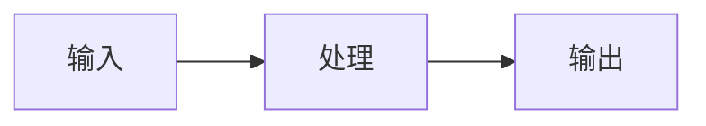

```
---
title: "文章标题"
aliases: []
tags: []
category: ""
published: "2026-07-30"
updated: "2026-07-30"
draft: false
publish: false
---
```
# {{title}}

> [!summary] 摘要
> 用 1–3 句话说明这篇笔记解决什么问题、结论是什么。

## 关键信息

- **结论**：
- **下一步**：
- **来源**：

---

## 标题与文字

### 三级标题

普通文字、**粗体**、*斜体*、***粗斜体***、~~删除线~~、==高亮==、`行内代码`。

> 引用内容。
>
> 可以跨多个段落。

---

## 列表与任务

- 无序列表
  - 二级条目
- 另一个条目

1. 有序列表
2. 第二项

- [ ] 待办事项
- [x] 已完成事项

---

## 链接、图片与附件

- 外部链接：[GitHub](https://github.com/)
- Obsidian 双链：[[另一篇笔记]]
- 带别名双链：[[另一篇笔记|显示名称]]
- 指向标题：[[另一篇笔记#某个标题]]
- 图片：

> [!tip]
> 公开文章使用 PicList 上传后的公开 HTTPS 图片链接；不要使用包含 `?token=` 的临时链接。

---

## 提示框（Callout）

> [!note] 笔记
> 一般补充说明。

> [!info] 信息
> 可用于背景、定义或参考资料。

> [!warning] 注意
> 记录风险、限制或待验证项。

> [!question]- 可折叠内容
> 标题后的 `-` 代表默认折叠；改成 `+` 则默认展开。

---

## 代码与数学公式

```python
def greet(name: str) -> str:
    return f"Hello, {name}!"
```

行内公式：$E = mc^2$

$$
\sum_{i=1}^{n} i = \frac{n(n+1)}{2}
$$

---

## 表格

| 项目 | 说明 | 状态 |
| --- | --- | --- |
| 示例 A | 简短描述 | ✅ |
| 示例 B | 待补充 | ⏳ |

---

## Mermaid 图表



---

## 脚注与注释

这是带脚注的句子。[^1]

[^1]: 在页面底部显示的补充内容。

%% 这是一段仅在 Obsidian 编辑时可见的注释。 %%

---

## 参考资料

- 

